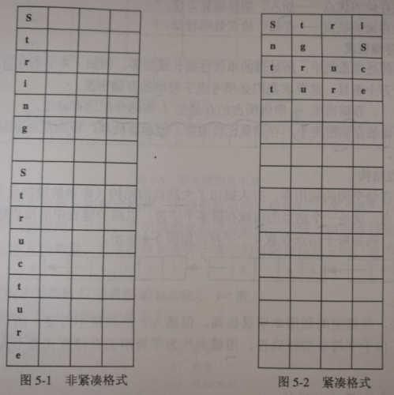
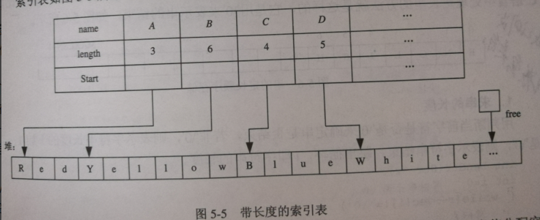

# 定义

> 字符串简称串，是一种特殊的线性表，它的数据元素仅由一个字符组成。
>
> 串(String)是由零个或多个字符组成的有限序列

$$
s=' a_1a_2\cdots a_n '
$$

- **串的长度**:  一字符串中，字符的个数
- **空串**: 长度为零的字符串
- **空格串(blank string)**：由一个或多个空格组成的串
- **串相等**：是指两个串的长度相等且对应的字符都相等
- **子串**:  –串中任意连续的字符组成的子序列称为该串的子串
- **主串**：包含子串的串称为该子串的主串
- **模式匹配**: 子串的定位运算又称为模式匹配，是一个求子串的队医给字符在主串中序号的运算。被匹配的主串称为目标串，子串称为模式。


# 表示和实现

因为串是数据元素类型为字符型的线性表，所以用于线性表的存储方式仍适合与串。但是由于串中的数据元素是单个字节，其存储方式又有其特殊之处。


## 定长顺序存储

> 类似于线性表，可以用一组地址连续的存储单元依次存放串中的各个字符序列，利用存储单元地址的顺序表示串中字符的相邻关系
>


### 定长存储的C语言描述

```c
#define MAXLEN 10
typedef struct
{
	char vec[MAXLEN];
	int len;
} Str;//可用Str来定义该类型的结构体变量
```

**特点：**

- 为串变量分配一个预定义、固定长度的存储区
- 实际串长度保存在数组下标=0的位置
- `\0`表示串值的终结


### 存储方式

当计算机按**字节(Byte)**为单位便地址时，<mark>一个存储单元刚好存储一个字符</mark>,串中相邻的字符顺序地存储在地址相邻的存储单元中.

当计算机按**字(例如1字32位)**为单位便地址时，<mark>一个存储单元可以有4个字节组成</mark>。此时顺序存储结构又有**非紧凑格式**和**紧凑格式**两种存储方式。



**1)非紧凑格式**

设`S=“String Structure”`,计算机字长为32位(4个Byte)，使用非紧凑格式一个地址只能存储一个字符，如图5-1所示。优点是运算处理简单，但缺点是存储空间十分浪费。

**2)紧凑格式**
同样存储`S=“String Structure”`，使用紧凑格式格式一个地址能存四个字符，如图5-2所示。紧凑存储的优点是空间利用率高，缺点是对串中字符处理的效率低。


## 块链存储

对于长度不确定的字符串的输入，若采用定长字符串存储就会产生这样的问题:存储空间定的大，而实际输入字符串长度小，则造成内存空间的浪费，反之，存储空间定的小，而实际输入字符串长度大，则存储空间不够用。此时可采用链接存储的方法。

> 用链表存储字符串，每个结点有两个域：一个是数据域(data)和一个指针域(next)。
>
> 其中数据域(data)–存储串中的字符。指针域(next)–存放后继结点的地址

以存储`S=“String Structure”` 为例，链式存储结构如图所示。


**优缺点：**

- 链式存储的优点–插入、删除运算方法；
- 链式存储的缺点==存储，检索效率较低。

**由于字符串的特殊性，用链表存作为字符串的存储方式也不太实用，因此使用较少。**


## 堆分配存储

在实际应用中，往往要定义很多字符串，并且各字符串长度在定义之前又无法确定。在这种情况下，可以采用**堆分配存储(也称为索引存储)**，这是一种动态存储结构。

### 堆分配存储的方法

1. 开辟一块地址连续的存储空间，用于存储各串的值，该存储空间称为"堆"(也称自由存储区)
2. 另外建立一个索引表，用来存储串的名称(name),长度(length)和该串在"堆"中存储的起始地址(Start)。
3. 程序执行过程中,每产生一个串，系统就从"堆"中分配一快大小与串的长度相同的连续的空间，用于存储该串的值，并且在索引表中增加一个索引项，用于登记该串的名称、长度、和该串的起始地址。
   

### 索引存储的例子

设字符串:

```python
A=“Red”
B=“Yellow”
C=“Blue”
D=“White”
```

用指针free指向堆中的未使用空间的首地址。索引表如图5-5所示



考虑到对字符串的插入和删除操作，可能引起字符串的长度变化，在“堆”中为串值的分配空间是，可预留适当的空间。这时，索引表的索引项应增加一个域，用于存储该串在“堆”中拥有的实际存储单元的数量。当字符串长度等于该串的实际存储单元时，就不能对串进行插入操作。

**带长度的索引表的C语言描述：**

```c
#define MAXLEN 10
typedef struct
{
	char name[MAXLEN];//串名
	int length;//串长
	char *Stradr;//起始地址
} LNode 
```


# 串的比较

## 比较方式

> 通过组成串的字符的编码进行比较。字符编码，即字符在对应字符集中的符号。

**串相等条件：**

1. 串长度相等
2. 对应位置的字符相等


## 常用计算机字符编码

- **标准ASCII码**：7位二进制=1个字符、可表示$2^7=128$个字符
- **扩展ASCII码**：8位二进制=1个字符、可表示$2^8=256$个字符
- Unicode编码：16位二进制=1个字符、可表示$2^16$个字符、为了兼容ASCII码，Unicode码的前256个字符与ASCII码相同


# 串的模式匹配

> 子串的定位操作通常称作串的模式匹配(其中T称为**模式串**)

## KMP模式匹配算法

[KMP模式匹配算法详解](http://www.ruanyifeng.com/blog/2013/05/Knuth%E2%80%93Morris%E2%80%93Pratt_algorithm.html)

**核心思想：**

1. 利用已对比的主串&子串的信息，控制子串j值的变化
2. 从而减少不必要的回溯 字符串的比对(i值不回溯，仅回溯j值)，从而提高效率

**作用：**

- 避免了朴素模式匹配算法中没必要的循环回溯字符串的对比

**特点：**

- 由于i值不回溯，仅回溯j值，效率高
- $总时间复杂度=O(m) + O(n) = O(m+n)$ 比 朴素模式匹配算法好： $O((n - m + 1) * m)$

**应用场景：**

- 当子串与主串存在较多"部分匹配"的情况下


## 具体算法

**概念：**字符串的前缀&后缀

| 概念 |                   定义                    |              实例               |
| :--: | :---------------------------------------: | :-----------------------------: |
| 前缀 | 除了最后1个字符，一个字符串的全部头部组合 | s="abcd" 前缀：’a‘, 'ab', 'abc' |
| 后缀 | 除了第1个字符外，一个字符串的全部尾部组合 | s="abcd" 后缀：'b', 'bc', 'bcd' |


**具体使用:**

1. 计算出子串（T串）各个位置的 `j` 值的变化
2. 根据步骤1计算出的`next`数组，将子串与主串进行模式匹配


