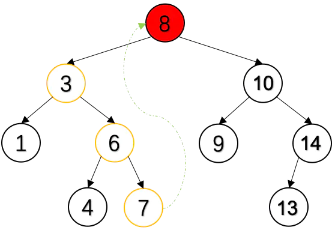
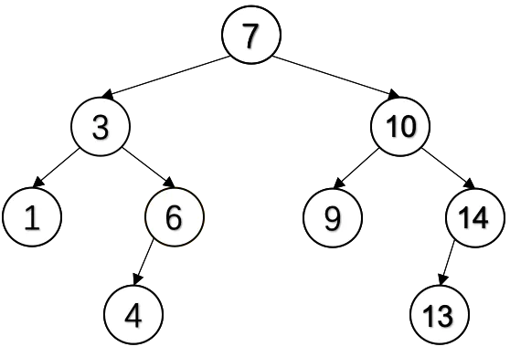
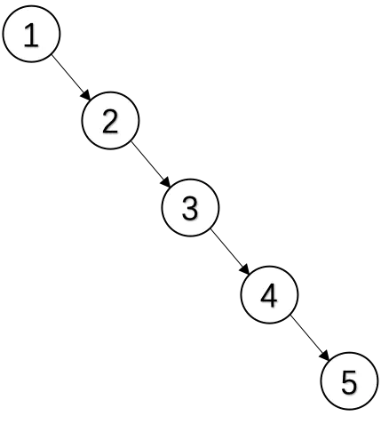

# 数据结构与算法(6-5)--BST

## 前言

大家都知道，链表适合需要频繁插入、删除数据的场景。但虽然说链表的插入、删除操作比数组性能好很多，但是在插入、删除之前仍需要从头遍历找到该元素，这同样是比较耗时的。因此，人们想到借助二分的方法优化链表的查找——二叉查找树登上舞台，提高数据插入和删除的效率。今天这篇博文带大家一起探讨一下二叉查找树的内容。


## 定义和性质

二叉查找树（Binary Search Tree），又称为二叉排序树（Binary Sort Tree）。二叉查找树或者是一棵空树，或者是具有下列性质的二叉树：

- 若左子树不空，则左子树上所有节点的值均小于它的根节点的值；
- 若右子树不空，则右子树上所有节点的值均大于或等于它的根节点的值；
- 左、右子树也分别为二叉查找树；
- 没有键值相等的节点。


下图二叉树便是一棵典型的二叉查找树。对二叉查找树进行**中序遍历**便可得到有序序列。


## 设计实现

### 查找元素

根据二叉查找树的性质，想要查找树中一个值，只需要从根节点开始查找，如果目标值小于根节点的值就在根节点的左子树中查找，否则就在根节点的右子树中查找；在子树的根节点仍然按照同样的原则进行查找。因此，这是一个递归过程。在理想情况下，每次比较过后，树会被砍掉一半，近乎折半查找。


### 增加元素

二叉排序树的插入是建立在二叉排序的查找之上的，原因很简单，添加一个节点到合适的位置，就是通过查找发现合适位置，把节点直接插入即可。


### 删除元素

在二叉查找树删去一个节点，分三种情况讨论：

- 若目标节点O为叶子节点，即OL（左子树）和OR（右子树）均为空树。由于删去叶子节点不破坏整棵树的结构，则只需修改其双亲节点的指针即可。
- 若目标节点O只有左子树OL或右子树OR，此时只要令OL或OR直接成为其父节点P的左子树（当O只有左子树时）或右子树（当O只有右子树时）即可，作此修改也不破坏二叉查找树的特性。
- 若目标节点O的左子树和右子树均不空。在删去目标节点O之后，为保持其它元素之间的相对位置不变，可按中序遍历保持有序进行调整，可以有两种做法：
  - 令O的左子树为其父节点P的左/右子树（依O是P的左子树还是右子树而定），节点S为O左子树的最右下的节点，而O的右子树为P的右子树；
  - 令O的直接前驱（in-order predecessor）或直接后继（in-order successor）替代O，然后再从二叉查找树中删去它的直接前驱（或直接后继）

由于前两种情况比较直观，因此这里只着重说明一下第3中情况。以图1中的二叉树为例，想要删除**节点8**（例子中，我们使用直接前驱替换O，然后再删除O的直接前驱策略，当然使用直接后继替换也是可以的）。


首先，找到该节点的左子树最右下的节点7，因为节点7是节点的**直接前继**。



最后，用节点7代替节点8，然后删除节点7即可。



**完整代码：**

```java
import java.util.LinkedList;


class TreeNode{
    int val;

    TreeNode left;
    TreeNode right;
    TreeNode(int x){
        val = x;
    }
}

/**
 * @Author: Jeremy
 * @Date: 2019/6/22 20:30
 */
public class BinarySearchTree {
    public TreeNode parent = null;

    /**
     * 二叉查找树查找元素
     *
     * @param root 二叉查找树的根节点
     * @param val  需要查找的目标值
     * @return
     */
    public TreeNode search(TreeNode root, int val) {
        if (root == null) {
            return null;
        }
        if (val < root.val) {
            // 记录当前节点的父节点
            this.parent = root;
            return search(root.left, val);
        } else if (val > root.val) {
            // 记录当前节点的父节点
            this.parent = root;
            return search(root.right, val);
        } else {
            return root;
        }
    }

    /**
     * 增加新节点
     *
     * @param root 二叉查找树的根节点
     * @param val  需要增加的目标值
     * @return
     */
    public TreeNode insert(TreeNode root, int val) {
        // 由于性质4，因此插入之前先判断该值是否存在
        TreeNode node = search(root, val);
        if (node == null) {
            TreeNode newNode = new TreeNode(val);
            if (parent == null) {
                root = newNode;
            } else if (val < parent.val) {
                parent.left = newNode;
            } else if (val > parent.val) {
                parent.right = newNode;
            }
        }
        // 返回根节点
        return root;
    }

    /**
     * 删除节点
     *
     * @param root 二叉查找树的根节点
     * @param val  需要删除的目标值
     * @return
     */
    public TreeNode delete(TreeNode root, int val) {
        if (root == null) {
            return root;
        }

        // 首先搜索该节点，如果不存在直接返回false
        TreeNode o = search(root, val);
        if (o == null) {
            return root;
        }

        if (o.left == null && o.right == null) {
            // 情况1：如果该节点为叶子节点，直接删除即可
            // o为左节点
            if (parent.left == o) {
                parent.left = null;
            } else {  // o为右节点
                parent.right = null;
            }
        } else if (o.right == null) {
            // 情况2-1：如果该节点只有左子树
            // o为左节点
            if (parent.left == o) {
                parent.left = o.left;
            } else {  // o为右节点
                parent.right = o.left;
            }
        } else if (o.left == null) {
            // 情况2-2：如果该节点只有右子树
            // o为左节点
            if (parent.left == o) {
                parent.left = o.right;
            } else {  // o为右节点
                parent.right = o.right;
            }
        } else {
            // 情况3：该节点既有左子树，又有右子树
            TreeNode q = o;
            TreeNode s = o.left;
            while (s.right != null) {
                q = s;
                s = s.right;
            } // 转左，然后向右到尽头
            // s指向被删节点的“前驱”
            o.val = s.val;
            if (q != o) {
                // 重接q的右子树
                q.right = s.left;
            } else {
                // 重接q的左子树
                q.left = s.left;
            }
        }
        return root;
    }

    /**
     * 获取节点个数
     *
     * @param root
     * @return
     */
    public int size(TreeNode root) {
        if (root == null) {
            return 0;
        }
        return size(root.left) + 1 + size(root.right);
    }

    /**
     * 获取二叉查找树的高度
     *
     * @param root
     * @return
     */
    public int height(TreeNode root) {
        if (root == null) {
            return 0;
        }

        int leftHeight = height(root.left) + 1;
        int rightHeight = height(root.right) + 1;
        return leftHeight > rightHeight ? leftHeight : rightHeight;
    }

    /**
     * 获取最大值
     * @param root
     * @return
     */
    public int max(TreeNode root){
        if (root == null){
            return 0;
        }
        if (root.right == null){
            return root.val;
        }

        return max(root.right);
    }

    /**
     * 获取最小值
     * @param root
     * @return
     */
    public int min(TreeNode root){
        if (root == null){
            return 0;
        }
        if (root.left == null){
            return root.val;
        }

        return min(root.left);
    }

    /**
     * 中序遍历二叉树，非递归
     *
     * @param root
     */
    public void inOrderTraverseNoRecursion(TreeNode root) {
        LinkedList<TreeNode> stack = new LinkedList<TreeNode>();
        TreeNode currentNode = root;
        while (currentNode != null || !stack.isEmpty()) {
            // 一直循环到二叉树最左端的叶子结点（currentNode是null）
            while (currentNode != null) {
                stack.push(currentNode);
                currentNode = currentNode.left;
            }
            currentNode = stack.pop();
            System.out.print(currentNode.val + " ");
            currentNode = currentNode.right;
        }
        System.out.print("\n");
    }

    public static void main(String[] args) {
        TreeNode a = new TreeNode(8);
        TreeNode b = new TreeNode(3);
        TreeNode c = new TreeNode(10);
        TreeNode d = new TreeNode(1);
        TreeNode e = new TreeNode(6);
        TreeNode f = new TreeNode(14);
        TreeNode g = new TreeNode(4);
        TreeNode h = new TreeNode(7);
        TreeNode i = new TreeNode(13);

        a.left = b;
        a.right = c;

        b.left = d;
        b.right = e;

        c.right = f;

        e.left = g;
        e.right = h;

        f.left = i;

        BinarySearchTree binarySearchTree = new BinarySearchTree();

        // 中序遍历
        binarySearchTree.inOrderTraverseNoRecursion(a);

        // 查询节点
        TreeNode node = binarySearchTree.search(a, 14);
        System.out.println(node.val);

        // 插入节点
        TreeNode root = binarySearchTree.insert(a, 9);
        System.out.println(c.left.val);
        // 中序遍历
        binarySearchTree.inOrderTraverseNoRecursion(root);

        // 删除节点
        root = binarySearchTree.delete(root, 8);
        binarySearchTree.inOrderTraverseNoRecursion(root);

        // 获取节点个数
        int size = binarySearchTree.size(root);
        System.out.println(size);

        // 获取树高度
        int height = binarySearchTree.height(root);
        System.out.println(height);

        // 获取最小值
        int min = binarySearchTree.min(root);
        System.out.println(min);

        // 获取最大值
        int max = binarySearchTree.max(root);
        System.out.println(max);
    }
}

```


### 效率分析

1. **查找代价**：任何一个数据的查找过程都需要从根结点出发，沿某一个路径朝叶子结点前进。因此查找中数据比较次数与树的形态密切相关。

   1. 当树中每个节点左右子树高度大致相同时，树高为logN。则平均查找长度与logN成正比，查找的平均时间复杂度在O(logN)数量级上。

   2. 当先后插入的关键字有序时，BST退化成单支树结构。此时树高n。平均查找长度为(n+1)/2，查找的平均时间复杂度在O(N)数量级上。如图所示。

      

2. **插入代价**：新节点插入到树的叶子上，完全不需要改变树中原有结点的组织结构。插入一个节点的代价与查找一个不存在的数据的代价完全相同。

3. **删除代价**：当删除一个节点P，首先需要定位到这个结点P，这个过程需要一个查找的代价。然后稍微改变一下树的形态。如果被删除节点的左、右子树只有一个存在，则改变形态的代价仅为O(1)。如果被删除节点的左、右子树均存在，只需要将当P的左孩子的最右下的叶子结点与P互换，再改变一些左右子树即可。因此删除操作的时间复杂度最大不会超过O(logN)。

   